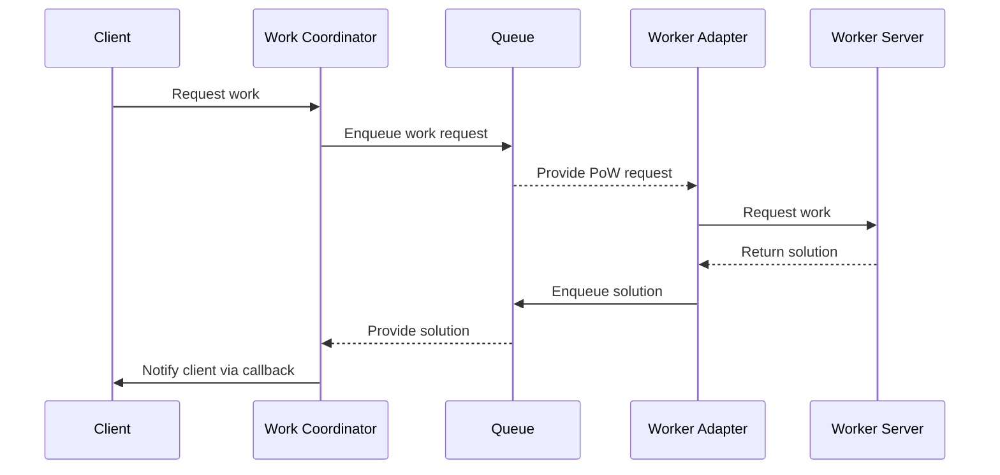

# Work Coordinator

The Work Coordinator acts as a conduit, connecting client PoW requests with a message queue system. It receives requests
through a REST interface and queues them for processing by workers. These workers are tasked with solving the hashes
and, once they find a solution, they post the results back to a different queue. The Work Coordinator then captures
these solutions and notifies the client via an HTTP callback.

This setup allows for precise control over the workers' load, maximizing hardware efficiency and enabling the system to
scale up or down automatically based on the workers' capacity and the current queuing state.



## Endpoints

```
POST /works/{hash}

{
  "network": "LIVE",
  "timestamp": "2023-11-05T12:00:00Z",
  "callback": "http://example.com/callback"
}

```

## Callback

````
POST ?

{
  "hash": "89EB0D6A8A691DAE2CD15ED0369931CE0A949ECAFA5C3F93F8121833646E15C3",
  "work": "a7e077e02e3e759f"
}

````

## Supported Messaging Systems

### GCP Pub/Sub

| Environment Variable                            | Description                                                                             | Default value  |
|-------------------------------------------------|-----------------------------------------------------------------------------------------|----------------|
| PUBSUB_PROJECT_ID                               | GCP Project Id                                                                          |                |
| PUBSUB_SUBSCRIBER_MAX_OUTSTANDING_ELEMENT_COUNT | Maximum number of outstanding elements to keep in memory before enforcing flow control. | Long.MAX_VALUE |
| PUBSUB_WORK_REQUESTED_TOPIC                     | Topic where work requests will be sent.                                                 |                |
| PUBSUB_WORK_GENERATED_SUBSCRIPTION              | Subscription where coordinator will consume generated work.                             |                |

### Others

Currently, GCP Pub/Sub is the only messaging system supported. If you want to support a particular messaging system,
please
open a feature request.